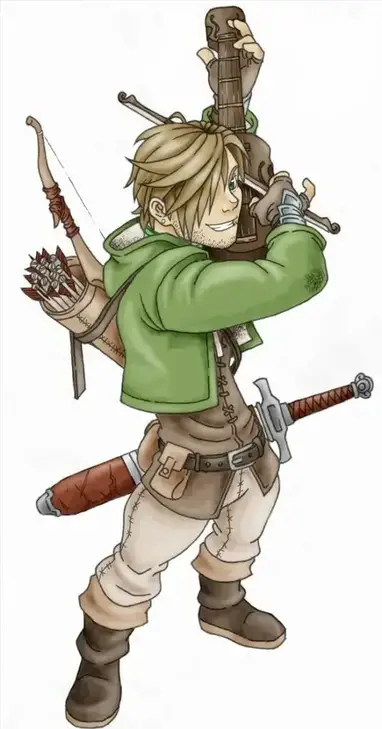
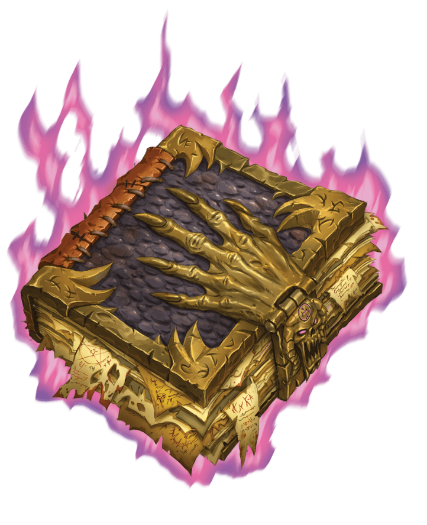

# Aluna Tiffal (Gnome Bard (Arcane Archer))

- Plays the fiddle
- Worked with Ophala
  - Stole a fine piece of art from Phandalin headman
    - Harban (Headman of Phandalin)
  - Worked with her before
- Black pants and boots with longer jacket with fur

# Orla

- Small tiefling (Purple)
  - Long curly black hair
  - Has a book
    - Fancy leather bound book with tons of pages just thrown in
  - "Super pretty from a distance" ~Orla to Ophala
  - Wearing plain travelers clothes
    - White puffy shirt
    - Vest
    - Pants
- Her Big Bad Book
  - The *Demonomicon of Iggwilv*
  - What escaped
    - Fraz-Urb'luu's staff
      - **weapon with the combined powers of a staff of command, a rod of beguiling, and a rod of rulership**.

# Venegance

Diety: Zeus

Been doing cherity work.

What are you avenging: There was a religious purge of the greek pantheon that is not making a resurgence. He is a member of the second crucade that has been tasked with converting other's to their pantheon as well as destroy those seeking to destroy them. 

Why are you in Neverwinter: This is his mission trip. 

He has been healing people and giving them pamphlets of the catholic faith.
