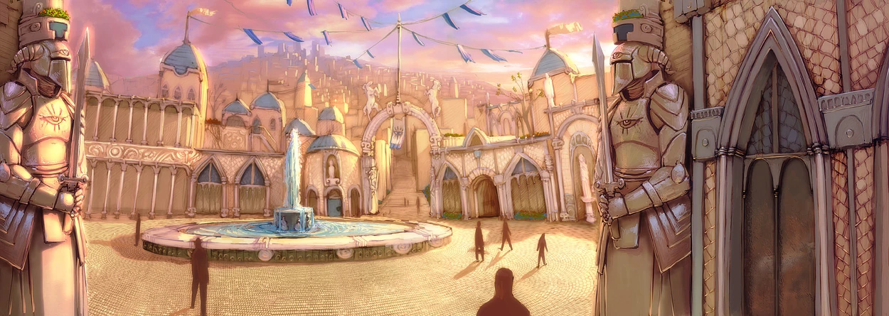
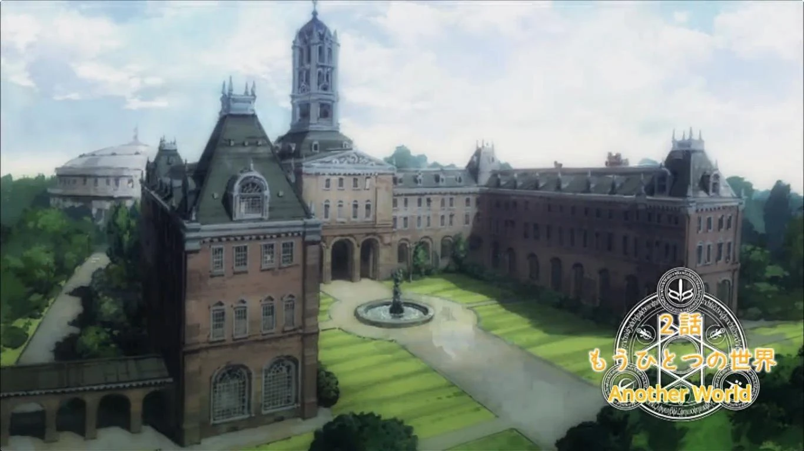

## Intro

```
THE FROZEN NORTH, A DESOLATE LAND WHERE GIANTS ROME THE ROLLING COUNTRY SIDE AND DRAGONS RULE THE SKIES. ONLY THE BOLD AND BRAVE SEEK TO TAME ITS WILD COUNTRY.*

HOWEVER, DEEP WITHIN THE WILDS A CITY STANDS AS THE LONE BASTION OF CIVILZATION. NEVERWINTER. SOMETIMES CALLED THE JEWEL OF THE NORTH, IS HOME TO GIFTED ARTISANS, VETERAN WARRIORS, AND EXPERT SPELL CASTERS.

BUT IN RECENT YEARS, THE CITY OF NEVERWINTER HAS BEEN BROUGHT TO ITS KNEES. WHAT STARTED OUT AS A MILD CONTAGION GREW INTO A PLAGUE SO SEVERE THE INHABITANTS NAMED IT THE WAILING DEATH. FIVE YEARS HAVE PASSED SINCE THE START OF THE PLAGUE AND IN THAT TIME NEVERWINTER HAS FALLEN FAR FROM ITS GRACE.

MANY OF THE CITY DIRSTRICTS ARE NOW COMPLETELY BARRED OFF FROM EACHOTHER WITH LITTLE TO NO CONTACT BETWEEN THEM. AT THE SAME TIME THE NEVERWINTER GUARD HAS DWINDLED TO ALL BUT A FEW DOZEN MALES AND FEMALES WHO ARE POORLY TRAINED AND OUTFITTED WITH THE BAREST OF EQUIPMENT. AS A RESULT POWERFUL FACTIONS HAVE RISEN UP WITHIN THE CITY WALLS AND THE CITY COUNCIL IS NOW THREATENED WITH COLLAPSE.

A RAY OF HOPE HAS BEGAN TO SHINE THROUGH THE DARKNESS. WITH THE HELP OF DIVINE PRIESTS OF TYR THE CITY COUNCIL, LEAD BY LORD NASHER ALAGONDOR, HAS FOUND A POSSIBLE CURE.

WITH THE END OF THE WAILING DEATH IN SIGHT, THE CITY COUNCIL HAS PUT OUT A CALL FOR ADVENTURERS WITH THE PROMISE OF FAME AND FORTUNE TO BE EARNED AS THE CITY BEGINS TO REBUILD FROM THE ASHES.

IN THE FOLLOWING WEEKS, LADY ARIBETH DE TYLMERANDE, PALADIN OF TYR AND NOW THE LORD COMMANDER OF NEVERWINTER'S CITY GUARD HAS BEGAN TO GATHER THE INCOMING ADVETURERS WITHIN THE NEVERWINTER ACADEMY. THERE, THE HOPEFUL RECRUITS WAIT TO HAVE THEIR PROWESS TESTED BEFORE THEY CAN TAKE ON TASKS TO HELP TAKE BACK THE CITY.
```

## Player 1: Arrival on the road

- Sees castle never looming in the distance.

```
Castle Never, towering over the western end of the city, is 
impossible to miss. The castle sits on the rocky cliffs and 
outcroppings on the north side of the estuary where the 
Neverwinter River and the Sea of Swords meet. The castle 
has a circular rock around its main structure from which 
three bridges radiate out over the Neverwinter River: the 
Sleeping Dragon Bridge, the Winged Wyvern Bridge, and 
the Dolphin Bridge.
```

## Gates of Neverwinter

Up ahead they see weary guards manning the Western Gate.



- They watch one of the gurads cut down a man who looks clearly ill.
- Guards request the PCs recieve a blessing from a priest of helm prior to entrance. (If they agree to recieve the blessing add them to the wailing death tracker.) When this player is given the choice also get the dicision from all other players on what their character decided.
- Player meets one other character at the gates who is having a hard time dealing with the guards. They have something in their pack that the guards demand to see but the player refuses to open it.

## Neverwinter Academy



- Once the players are through the gate they are directed to Neverwinter Academy.

  - At the Academy Entrance Fenthic Mos is greeting the new arrivals with Desther acompanying him.
  - Fenthic greets the newcomers and directs them towards the Senior Barracks.

  ## Senior Barracks
- Here the newcomers
