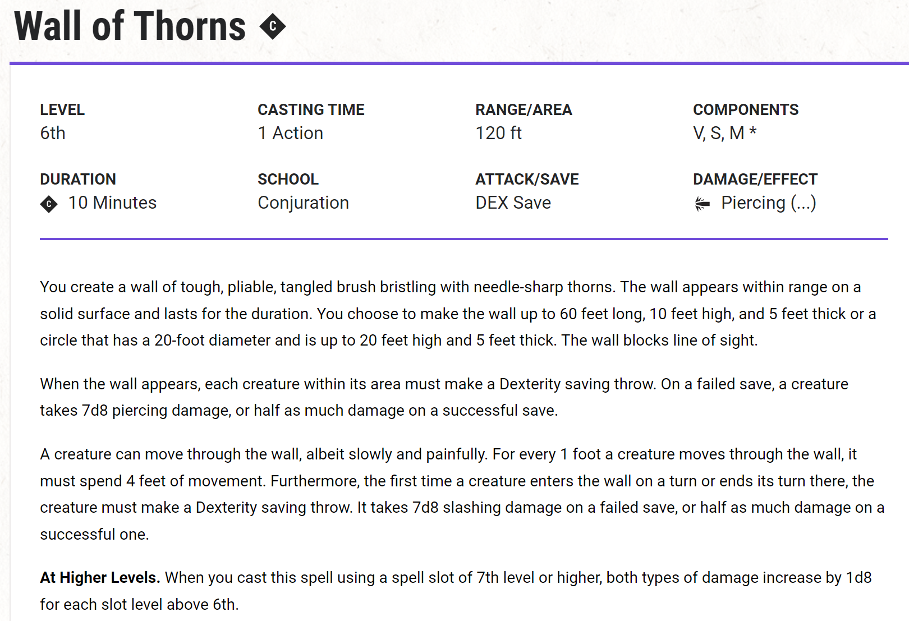
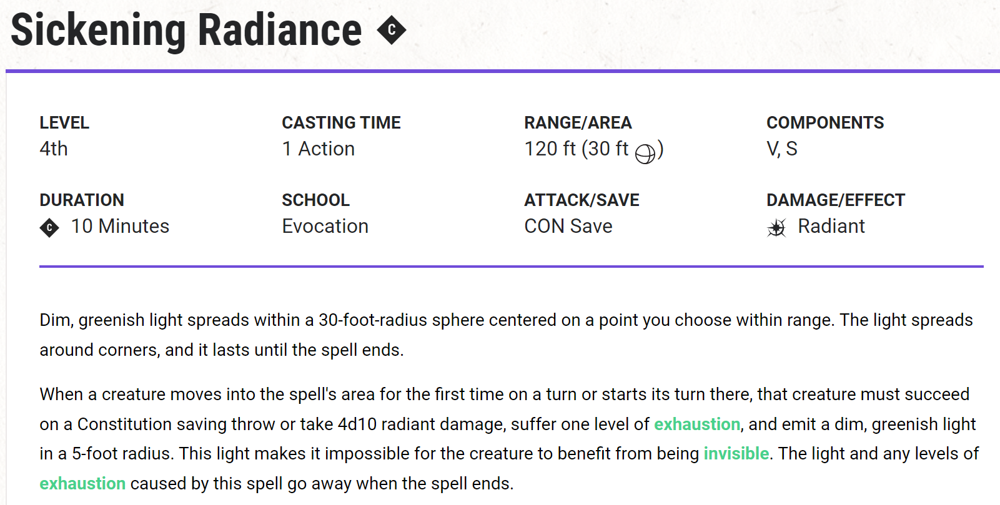
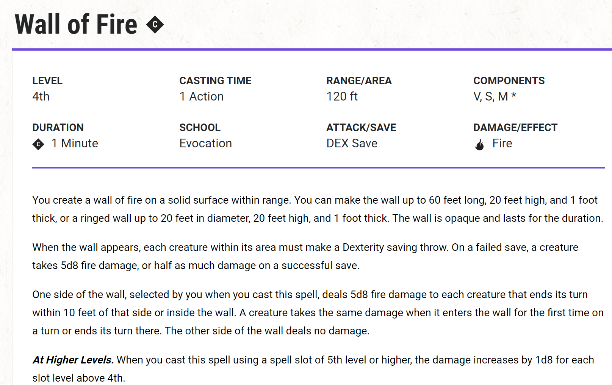
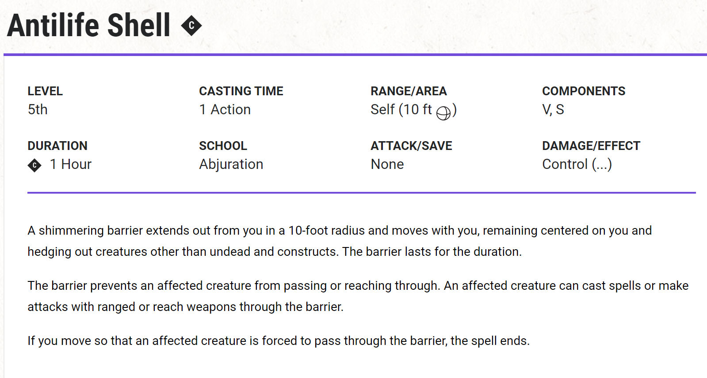
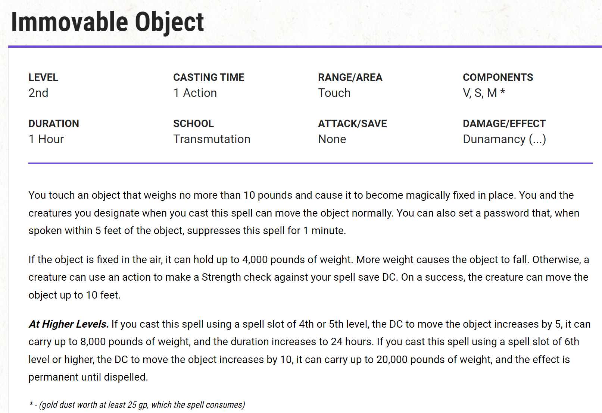
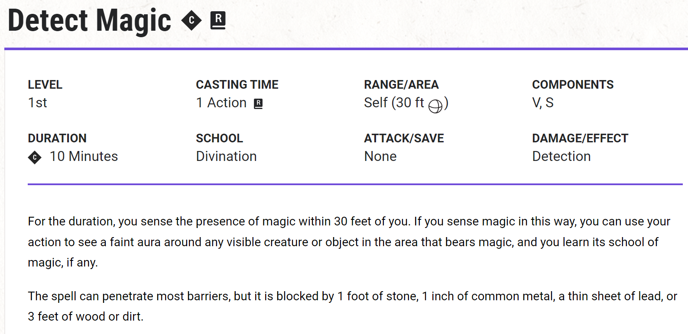
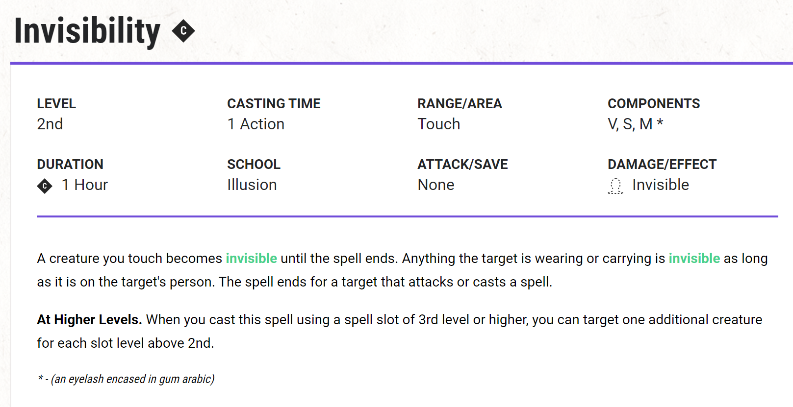
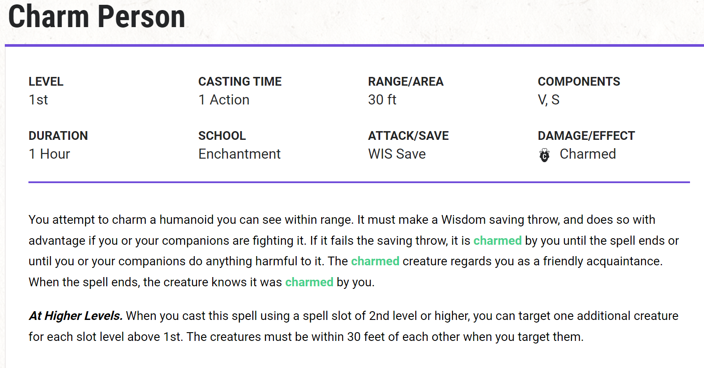
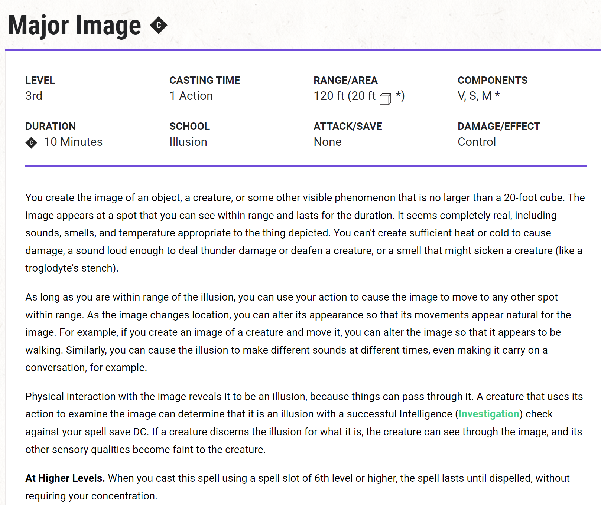

Professor Fibblewith

# Summary

In these trials the Player is presented with a table of arcane tools and 9 walls representing different schools of magic. Behind each wall is a feather and the players must obtain 4 feather's in total to succeed.

If a character wishes to make an Arcana check to determine things about the test the follwing DCs apply

To Determine Spell at play (These DCs are reduced by 5 if the player can cast that level of spell and an additional 5 if that spell is on their available spell list)

- Cantrip: DC 5
- 1st level spell: DC 8
- 2nd level spell: DC 11
- 3rd level spell: DC 14
- 4th level spell: DC 17
- 5th level spell: DC 20
- 6th level spell: DC 23

If the player beats the DC by 5 or more they can also discover which wand they are expected to use against this wall.

If the player fails the DC but fails by less than 5 they can at least discern the school of spell in play.

## Conjuration: Wall of Thorns

Bronze feather

## Necromancy: Sickening Radiance

Bronze Feather

## Evocation: Wall of Fire

Bronze Feather

## Abjuration: Anti Life Shell

Silver Feather

## Transmutation: Immovable Object

Silver Feather

## Divination: A detect magic zone and invisible feather

Gold Feather

Players jsut need to cast a divination spell within the zone and the feather will appear.

## Enchantment: Cast Charm Person

Bronze Feather (Gold if correct wand used)

## Illusion: Illusion hiding pit trap

There is no feather...

Gold Feather

## Items Available

As soon as any wand is used to obtain a feather that wand disapears.

- Wand of firebolt
- Wand of mage hand
- Wand of Levitate
- Wand of Resistance
- Wand of Minor Illusion (You are actually supposed to use this wand to create the illusion of a feather lol)
- Wand of Pyrotechinics
- Wand of locate object
- Wand of guidance: This wand is actually ment to be used within the divination room which is just waiting for a divination spell to be used to make the invisible feather appear.
