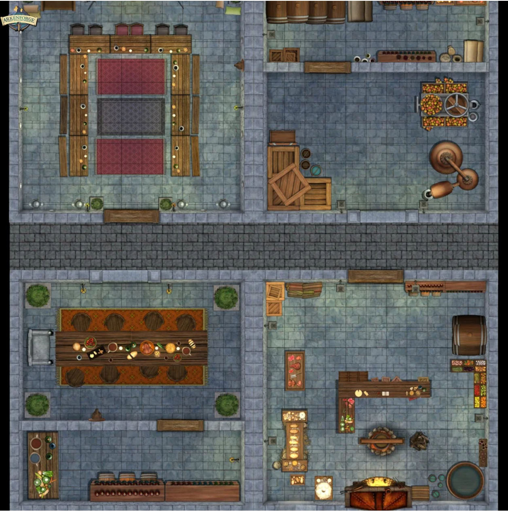

Continuing on past the store room the characters find themselves in a narrow hallway. 

```
The air smells damp with musk and torch light flickers to fill these narrow hallways. Up ahead, you can hear a strained voice shouting uncoharently accompanied by the sounds of battle. 
```

If the players move quickly they will come upon the scene of Pavel (one of their fellow senior barracks members) standing over the fallen corpse of his twin brother Bim. 

```
Peering into the open room you see a familiar face, Pavel, standing with his back to a wall facing down a group of goblins. Pavel's face is twisted with rage and regret as he brandishes his sword about wildly at the approaching goblins. 

At Pavel's feet you see the source of his grief. Bim, his twin brother is lying motionless in a pool of blood.

"Come on then!" Pavel screems through the tears "Lets finish this!"
```

# Combat notes

At the start of Pavels turn he slips in his brother's blood and falls prone, unable to get up for one round.

The goblins leave one of their group to deal with the fallen pavel as the rest turn to address the party. The Goblin boss does his best to keep clear of the most dangerous enemies (a cautious goblin lives to be the boss).

# After Combat

It is difficult to console Pavel at the death of his brother, but he is greatful to the party for saving his life. He will let them know that Bim and he followed a coweled figure through the hallways but were caught by surprise when the goblins suddenly appeared.


