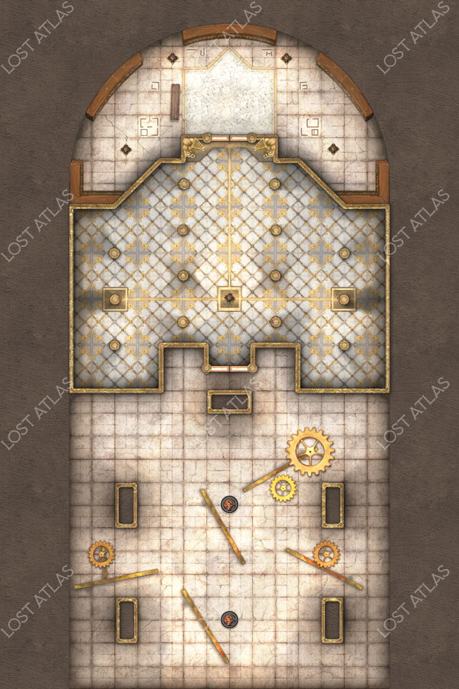

The mage makes his final stand in a large cooridore leading on to the Academy store rooms. 

If the players have been right on the mage's tracks they will see a group of goblins flood through the door before the mage slams it closed and casts an arcane lock upon it. At this point he will turn to the party to make his final stand. 

```
You come around the corner to see a the tail of a group of goblins rushing though a door. The cowled figure you have been chasing says a few brief words to a beefy orc before the two notice you and the orc leaves through the door. The mage slams it closed and casts a spell which manifests green energy along the door's edges before fading. The mage then turns to you with the stance of a man ready to die. 

His task complete, the mage turns towards you their stance that af a man ready to die. 
```

# Battle Notes

The mage is trying to waylay the players as long as possible to let his forces either destory or free the waterdavian creatures. 

# After Battle

The mage is carrying a wand of fear and 75 gp. 

If the players cannot bypas the arcane lock spell they will hear the sounds of battle in the next room. If they investigate the sounds they can discern that Fenthick and Desther are fighting off the horde of goblins who are killing and freeing the waterdavian creatures. 


