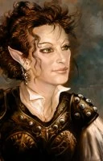

**Linu La'neral** is an [elven](https://nwn.fandom.com/wiki/Elf "Elf")[cleric](https://nwn.fandom.com/wiki/Cleric "Cleric") (of [Sehanine Moonbow](https://nwn.fandom.com/wiki/Sehanine_Moonbow "Sehanine Moonbow")) from Evereska who is constantly finding herself in awkward situations. She is kind, but her self-consciousness causes her to lose the grace of her race and descend into clumsiness at times, which only serves to make her more self-conscious. This, combined with her awful luck and uncanny timing leads many people to ask her to please help somewhere else.

Linu is a [henchman](https://nwn.fandom.com/wiki/Henchman "Henchman") who is available in both the [original](https://nwn.fandom.com/wiki/Original_campaign "Original campaign") and [Hordes of the Underdark campaigns](https://nwn.fandom.com/wiki/Hordes_of_the_Underdark_campaign "Hordes of the Underdark campaign"). As a cleric, Linu provides support for a player, healing the injured and [turning undead](https://nwn.fandom.com/wiki/Turn_undead "Turn undead"). In addition, she can deal out damage with [power attack](https://nwn.fandom.com/wiki/Power_attack "Power attack"), and she has some measure of survivability in combat, being one of the few henchmen who make use of a [shield](https://nwn.fandom.com/wiki/Shield "Shield") (the only such henchman in the original campaign).

**Bug:** The [AI](https://nwn.fandom.com/wiki/AI "AI") neglects to equip a shield when switching weapons. Since Linu must unequip her shield to wield her crossbow, doing so in the original campaign causes her shield to go unused (until the next chapter or her next level-up). This is also an issue in the Hordes of the Underdark campaign, but in that campaign, the player can access her inventory and manually equip a shield. This has been fixed in the [Enhanced Edition](https://nwn.fandom.com/wiki/Enhanced_Edition "Enhanced Edition").

**In-game description:** *While rubbing a stain off her shirt, this young elf glances around with a cheerful visage; yet there is a hardiness that belies her gentle exterior.*
