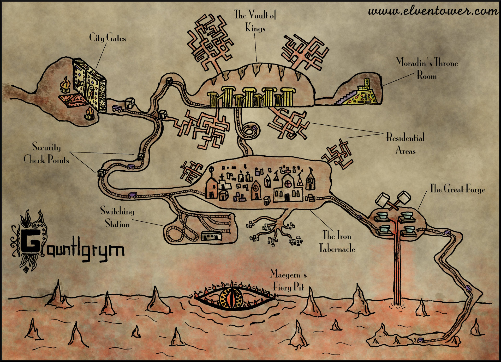
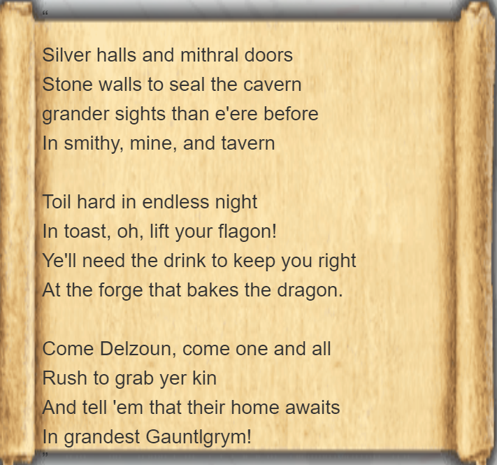

# Plot

1. Bone Naga: Lady Aribeth sends a group of adventurers to defeat or capture a bone naga and return it's spine to the Temple of Tyr. The bone naga has taken up root in the Vault of Kings and has been trapped there.

## NPCs

1. Ourik - Dwarven priest of Moradin (Dwarf forge god)
   1. Ourik meets the party at the City Gates and offeres to guide them to the vault of kings.
   2. Ourik is exceptionally open minded for a dwarf having lived among the tall folk for several decades as a young stub. He is friendly with the party and ready to help them solve various problems.

# Map

## The Vault of Kings

Here, two flail snails have began a mating ritual which involves banging their flails against the crypt doors. The players are to battle the flail snails so that the dwarves can return to their usual business and once again recieve the blessings of their ancestors.

When the character's arrive, the two snails have begun to `mate`. as a result, their two shells are inseperably conjoined together, giving them the appearance of a `huge` rock.

## Burning Heart

The Burning Heart was a steam-filled chamber beneath the Great Forge that contained a pure [adamantine](https://forgottenrealms.fandom.com/wiki/Adamantine "Adamantine") ziggurat that was used to tap the power of Maegera, the primordial used to power the Great Forge.

## Fiery Pit

The Fiery Pit was a deep magma-filled chasm in the depths of Gauntlgrym in which the primordial Maegera was kept in a semi-conscious slumber.During the time of the dwarves, they used the heat given off by Maegera to power the Great Forge.

## Great Cavern

The Great Cavern contained Gauntlgrym's main entrance and was a very large natural subterranean structure, covered with stalactites and stalagmites, with a lake at its centre.

## Great Forge

The Great Forge used the heat of Maegera in the Fiery Pit as its power source, and was a large chamber split into sections for furnaces and anvils. Some were raised and others were in shallow pits. A [pulley](https://forgottenrealms.fandom.com/wiki/Pulley "Pulley") system was used to transport buckets, containing water or ore, and this was accessed via raised stone catwalks. Tools made in the furnaces of the Great Forge were imbued with tiny amounts of primordial essence.

## Iron Tabernacle

The Iron Tabernacle, situated at the heart of the city, was Gauntlgrym's temple, although it covered a huge area containing a number of cathedrals, and was adorned with sculptures and intricate knotwork. It also contained a switching station which acted as a central hub for the magical automated mine carts that were used to transport ore across the city, via an extensive series of mine cart rails. A large crypt lay at the lowest part of the Iron Tabernacle, with burials ranging from simple ones to large sarcophagi, buried with full details of lineage. The crypt was protected by [ghosts](https://forgottenrealms.fandom.com/wiki/Ghost "Ghost") who would attack those who were not respectful of the dead.MinesAs of [1480 DR](https://forgottenrealms.fandom.com/wiki/1480_DR "1480 DR"), duergar mining activity was underway in the depths of Gauntlgrym. At first utilising the dwarven mines of the city, which were of traditional dwarven design, there were also much more dangerous duergar mines which were, in places, almost vertical, with makeshift homes at the bottom of some pits, to improve efficiency. Some of the deepest pits reached the large underground magma lakes of Mount Hotenow.

## Shrine of Sacrilege

As of [1480 DR](https://forgottenrealms.fandom.com/wiki/1480_DR "1480 DR"), a duergar shrine to [Asmodeus](https://forgottenrealms.fandom.com/wiki/Asmodeus "Asmodeus") had been constructed in one of the deeper pits within the mines, by using materials taken from the Iron Tabernacle, such as icons of [Moradin](https://forgottenrealms.fandom.com/wiki/Moradin "Moradin").

## The Causeway

Installed by King Bruenor, these tunnels contained rails on the ceiling and a magical effect that reversed gravity, allowing for carts to be rolled "down" to the surface.
