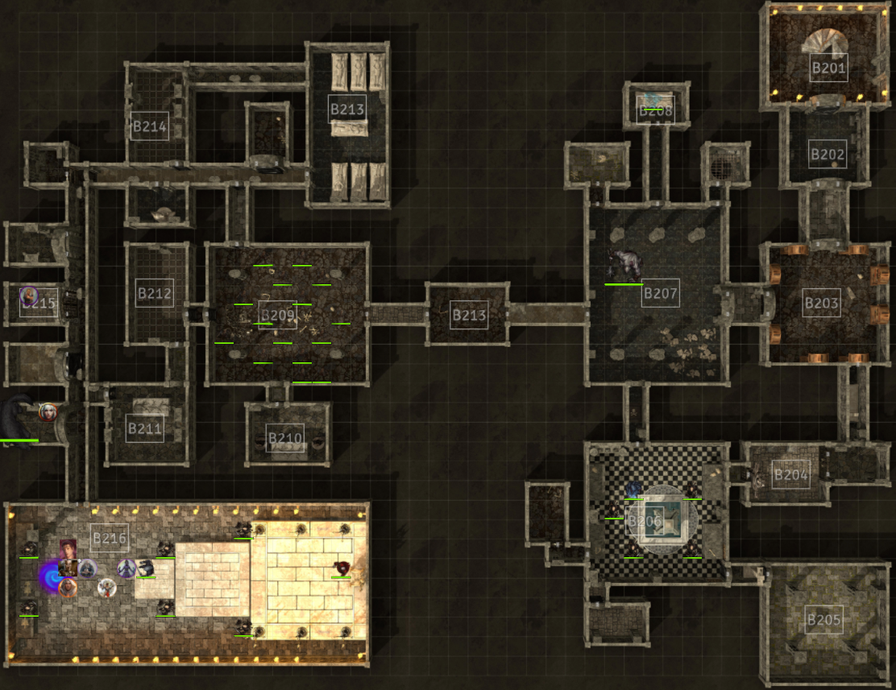
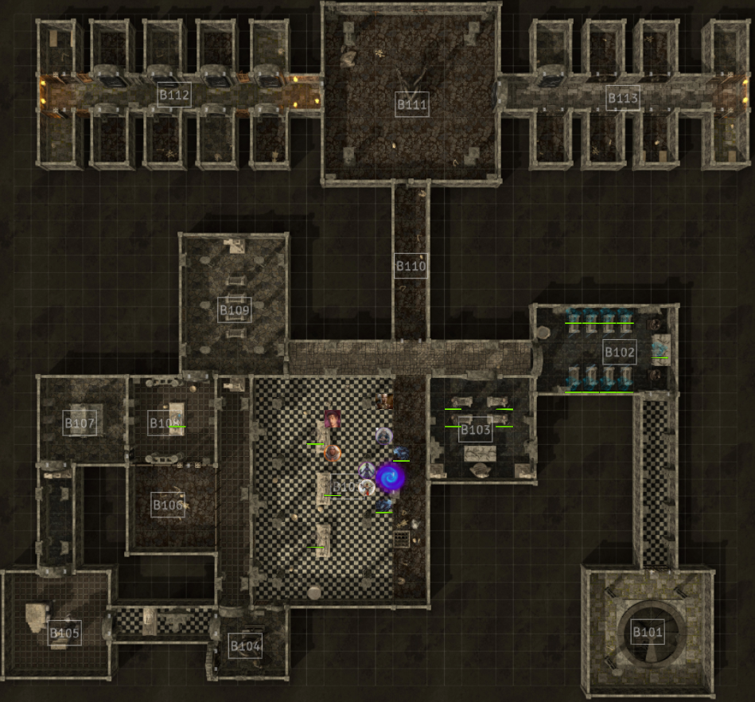
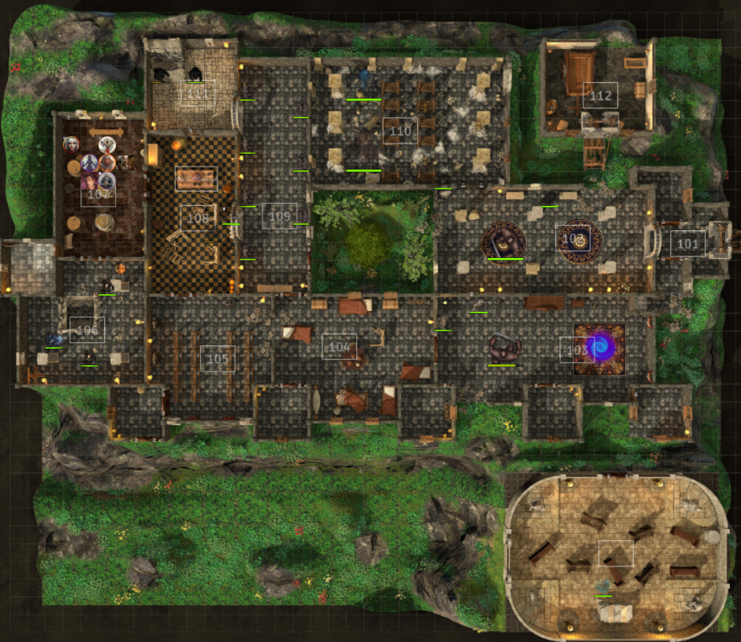
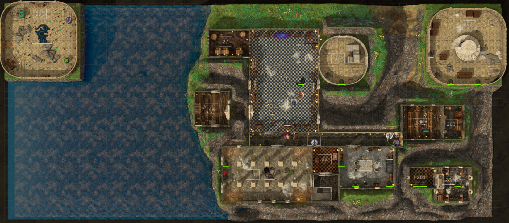
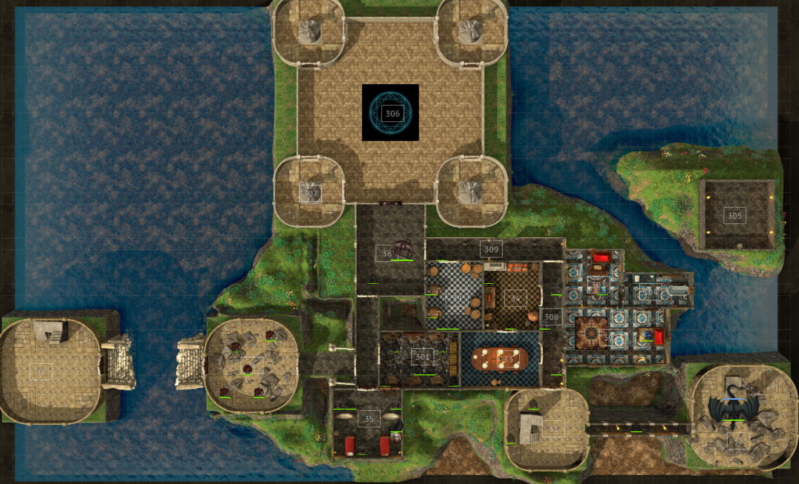
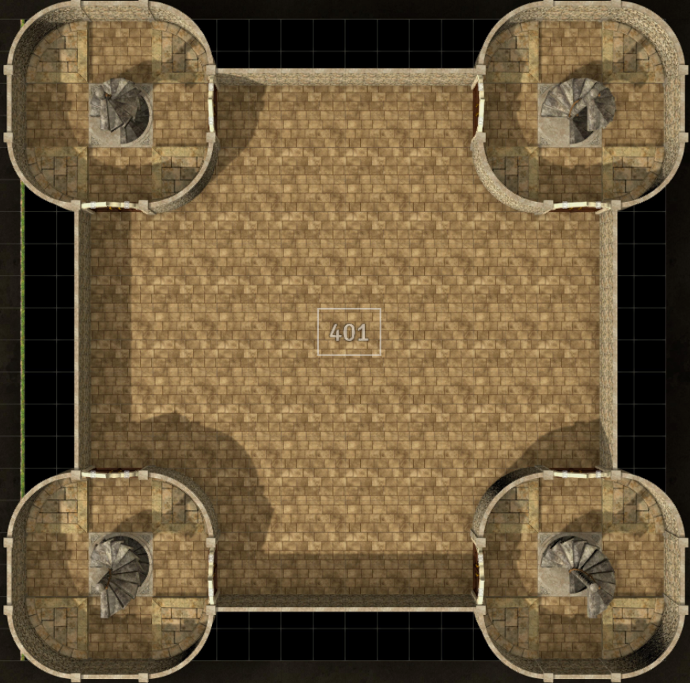
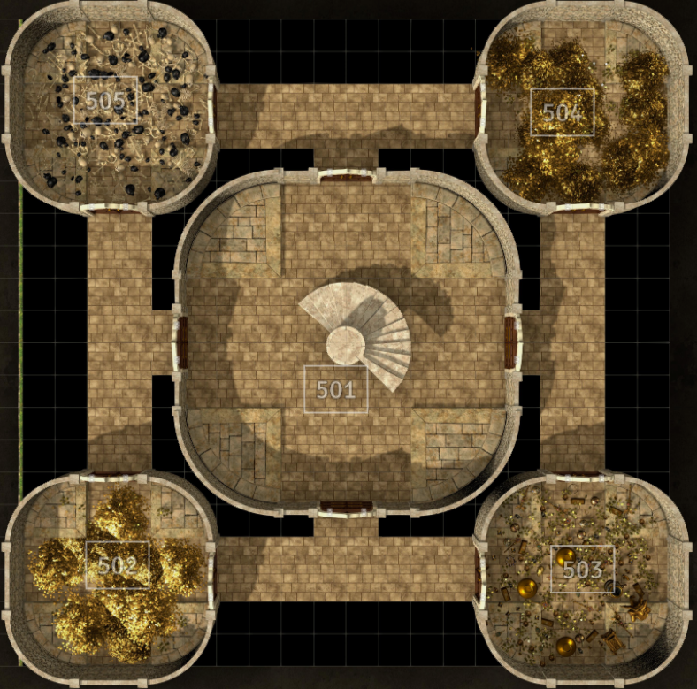
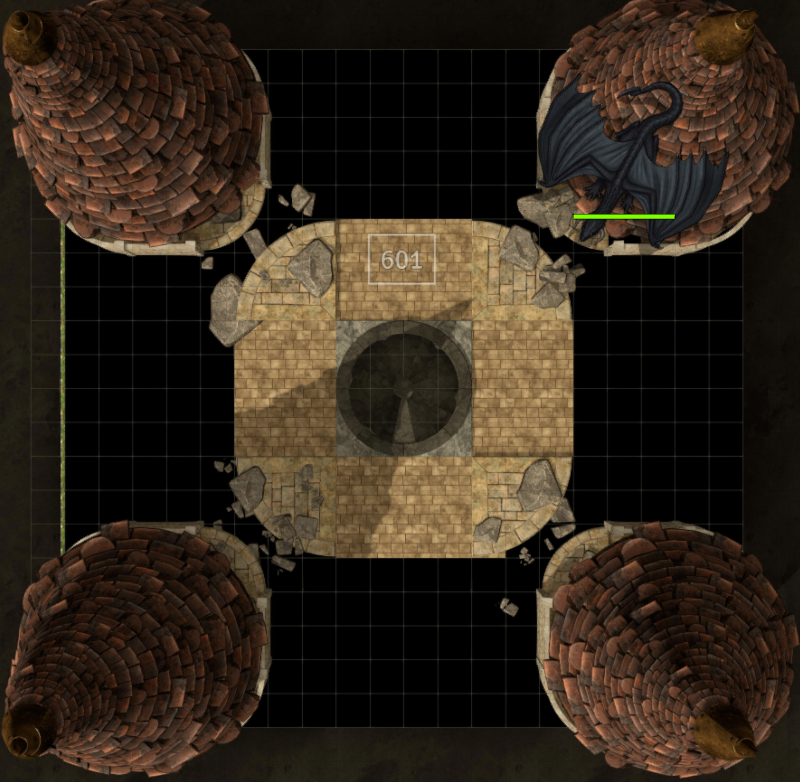

# Synopsis

The cult of origin has tracked the shadow dragon Nurvureem to Castle Never. They plan to parlay with the dragon and convince it to lay waste to the city of Neverwinter. Failing that, they plan to kill the dragon to deprive the city access to it's shadow heart

# Quest

Enter Castle Never and track down the shadow dragon to return with a heart of shadow.

# Reward

2 rolls on the CR 11+ treasure horde table and 5 rolls on the CR 11 plus individual treasure table

+1 Renown with the City of Neverwinter

Conditional Rewards

- +3 Renown with the spirits of Castle Never
- The Crown of Lord Haleuth Never
- +3 Renown with Nurvureem
- Access to the Shadowfell

# Powers at Play

## Nurvureem (Dark Lady) Shadow Dragon

Since her escape, Nurvureem has taken root in the highest towers of Castle Never. There, she wages a war against the haunting souls of Lord Haleuth Never's court.

### Motivations

Nurvureem wants the treasure, bones, and spirits that reside within Castle Never so that she can turn the castle into her new base of power. She has little regard for the denizens of Neverwinter, after all, a lion does not mind the ants that burrow outside its cave.

Nurvureem's true purpose it to get revenge on Lorn Haleuth Never for killing her brood several centuries ago. Before she fled the sword coast, she swore to return and bring an end to everything Lord Haleuth built with his hands and loins. 

If the party wants to side with Nurvureem she will require they complete the following Objectives:

- Bring her the treasure locked inside the vaults on the second floor (R23)
  - The chests are trapped with powerful magic
- Bring her old man bellows so that she can use him to gain greater controll over the castle
- Rid the Noble Spyre and Arcanist Spyre of their pests

### Minions

Nurvureem controls many raised shadows as well as two lieutenants.

#### Nardor (The Apprentice)

Nardor is a young black dragon on it's way to becoming a shadow dragon. Nurvureem is teaching him dark secrets in exchange for his services taking over Castle Never

#### Ursa (The Flesh Offering)

Ursa is a Goblin Wizard skilled in the arts of conjuration. Ursa has been summoning creatures from outside the castle as sacrifices for Nurvureem to user her breath weapon on. Once Nurvureem uses her breath weapon on these creatures, they rise as shadows under her controll.

## Legion of Bone

### Sofina (Red wizard and Necromancer Extrordinair)

Sofina is in service to her master **Szass Tam** a powerful archmage and the Zulkir of Necromancy.

Szass has sent Sofina to keep an eye on Neverwinter having learned that Mogrim and the rest of the Arcane Brotherhood have plans for the city.

Since Nurvureem took root in the Neverspire, Sofina has been waging a silent war against the drake in hopes that she can use it's powers to further her masters plans.

#### Motivations

Sofina seeks to control the castle so that her master can use it as a base of operations.

- Rid the castle of Nurvureem
- Claim the Scepter of Neverwinter to gain control over the Castle Guardians.

#### Minions

Sofina has a veritable army of undead at her disposal thanks to the Libram of Souls and Flesh left to her by her master

##### Deathlock Mastermind

The deathlock mastermind and its deathlocks are pacted to Szass but have been sworn in service to Sofina. Still the mastermind views Sofina as more of a rival than a master, and will turn on her the first chance it gets

##### Deathlocks

##### Skeletons

##### Zombies

#### Plan

Sofina plans to us the Libram of Souls and Flesh to cast Summon Undead at 9th level and have the creature aid her in a battle against Nurvureem.

## The Court of Lord Never

The spirits fo Lord Never and his court still roam the halls of Castle Never.

### Lord Halueth Never

Entrapped by the very swords put in place to guard against grave robbers, the spirit of Neverwinter's founding lord remains within the tomb of his corpse. From there he occasionally issues orders to his attendants and chief advisor Alfador

#### Motivation

Lord Never wishes freedom from his tomb and even more freedom for the spirits of his court. Should the players achieve this, Lord Never will bestow upon them the Crown of Neverwinter in thanks.

### The Neverwinter Nine

The spirits of the nine stand guard over lord Never. Though they have lost the ability to control their swords, and thus cannot free their liege, they are still willing to defend their lord till their last undying breath.

#### Talven

We shall not rest until his sword takes its rightful place.

#### Galavren

The only who remembers the promise left unfulfilled.

#### Floeshabel

#### Thracier (Absent)

#### Shoce

#### Coneth

#### N'halien

#### Tamper

#### Slade

## The Children of Origin

A sect of the children of origin seeks to turn the situation within Castle Never towards the destruction of Neverwinter. Equipped with a soul syphon, they plan to use its trapped power to suade either the eternal court or Nurvureem towards their destructive cause.

By the time the character's have entered Caste Never, the children of origin have already set up a base of operations theirin.

However the characters choose to handle the denizens of Castle Never, the Children of Origin will try to disrupt their plans.

### Desther

The servant of origin has been ordered to accompany the party into Castle Never and aid them in anyway he can.

Durring his time in their service, Desther will aid their quest in any way he can. However, Desther will feed his agents on the player's whereabouts and opetations within the Castle so that the Children of Origin can set up ambushes and disruptions.

## Other Noteable Denizens

### Large Luigi

This rather benevolent beholder once ruled the castle floors, until Nurvureem and The Necromancer arrived. Now, Large Luigi holds out in one of the collapsed towers, biding his time to escape.

### The Axe of Unbridled Knowledge

The Axe of Unbridled Knowledge was brought into Castle Never by a Purple Dragon Knight named Sir Galvahad. The Axe lead him to Castle Never to warn it's denizens of the Castle's impending destruction. However, the duo was too late in warning the castle lord at the time. The subsequent destruction killed Sir Galvahad and burried the Axe of Unbridled knowledge with him.

When the shadow dragon eggs activated and began raising the spirits of the undead, The corpse of Sir Galvahad and his fellow kights were animated as well. The Axe hopes to leave the posession of Sir Galvahad's new form, finding this companion rather boring in his undead state. Doing so requires that the undead Sir Galvahad be defeated in battle, and the Axe's new owner attune to it.

### Old Man Bellows

The soul living inhabitant of Caste Never, Old Man Bellows is the last in a long line of grounds keepers. His survival in the haunted palace to this point is thanks to his lineage. The spirits of Castle Never can sense Bellow's connection to his ancestors and treat him as they did the previous grounds keepers.

Old Man Bellows knows the castle grounds better than anyone else. He can tell the players the best way to get from place to place, as well as what creatures they might encounter along the way. Should the party be willing to pay him handsomly, Bellows can even act as their guide through the castle.

Should the party take a liking to Bellows, either of the main factions within the castle might take him hostage. Nurvureem and the Children of Origin might take him hostage to gain leverage over the Never Court. While the Never Court might take him hostage to prevent said leverage. In either case, Old Man Bellows is treated with the utmost respect suring his captivity, as none of the groups are truly willing to risk the Courts wrath should something happen to him.

### Peter the Poltregeist

Peter was the court jester in service to Lord Never. Now that his lord is captured and Alfador prevents him from seeing his master, Peter prefers to torment the denizens of the castle whenever possible.

Should the party rescue lord Never, Peter will be forever greatful. However, Peter has no sense of planning, and cannot think to ask the party for this favor himself. The party might learn of his wants from speaking to other members of the Never Court abouyt the Poltregeist.

### Guardians of the Castle

Many of the suits of armor and weapons within Castle Never were enchanted to fend off intruders. But just like the swords protecting Lord Never, they cannot discern the identity of their spiritual masters. As such, these weapons and armor are prone to attack any beings they detect within Castle Never until someone takes their place as the rightful king of Castle Never. Doing this requires a person to sit upon the throne while wearing the Crown of Neverwinter and the Scepter of Neverwinter.

### Spiders, Bats, and Rats oh my.

# Rooms of Note

## Castle Propper

### Atrium

During the height of the Alagondar family's rule, the castle boasted an open-air garden and aviary. It contained a lovely collection of flowers and other plants, as well as beautiful birds in ornate cages. Following the Ruining, the plants and birds alike were left to rot, and the atrium came to be overtaken by aggressive [myconids](https://forgottenrealms.fandom.com/wiki/Myconid "Myconid") that spawned from the spores of something in the plant collection. By the late 15^th^ century DR, they had managed to completely seal the once open roof, leaving the garden dark and trapping the smell of rot and the blooms of [fungus](https://forgottenrealms.fandom.com/wiki/Fungus "Fungus") inside.^[[9]](https://forgottenrealms.fandom.com/wiki/Castle_Never#cite_note-NCS-p151-9)^

### Great Hall

The castle's Great Hall was where the throne of the city's ruler was located. ^[[6]](https://forgottenrealms.fandom.com/wiki/Castle_Never#cite_note-NVN-6)^ ^[[13]](https://forgottenrealms.fandom.com/wiki/Castle_Never#cite_note-DC-13)^ It was appointed in marble with a red carpet,^[[13]](https://forgottenrealms.fandom.com/wiki/Castle_Never#cite_note-DC-13)^ and it contained ancient magical defenses that raised the alarm and sealed the gate if the castle came under attack.^[[6]](https://forgottenrealms.fandom.com/wiki/Castle_Never#cite_note-NVN-6)^

### Hall of Mirrors

This long corridor with a massive window on one end was adorned with full-length mirrors, ^[[9]](https://forgottenrealms.fandom.com/wiki/Castle_Never#cite_note-NCS-p151-9)^ ^[[10]](https://forgottenrealms.fandom.com/wiki/Castle_Never#cite_note-N-10)^ and was used by the royal family to practice posture and appearance. However, this proved to be one of the most horrific places in the castle when Mount Hotenow erupted: first the mirrors shattered, slashing all occupants to pieces, just before searing volcanic gasses blasted through the window and incinerated the bodies. The spiritual wound this left on the victims caused the ash and glass in the room to animate and slowly reenact the event whenever a living being entered the room. During this time, it came to also be known as the  **Hall of Ashen Mirrors** .^[[9]](https://forgottenrealms.fandom.com/wiki/Castle_Never#cite_note-NCS-p151-9)^

### The Vault

The treasures of Castle Never and its occupants were stored in a secure vault known to be one of the most tightly secured locations on the [Sword Coast](https://forgottenrealms.fandom.com/wiki/Sword_Coast "Sword Coast"). Portcullises on the windows and an alarm that quickly mobilized the guards were meant to ensure that no thief who got near the vault would escape. As of the late 1490s DR,^[[note 1]](https://forgottenrealms.fandom.com/wiki/Castle_Never#cite_note-HAT-time-14)^ the door to the vault itself was protected by  *[Mordenkainen&#39;s arcane seal](https://forgottenrealms.fandom.com/wiki/Mordenkainen%27s_arcane_seal "Mordenkainen's arcane seal")* .^[[11]](https://forgottenrealms.fandom.com/wiki/Castle_Never#cite_note-HAT-11)^

## Neverneath

Also known as the "Endless Maze", Neverneath was the catacombs of Castle Never, containing a fortified dungeon ^[[2]](https://forgottenrealms.fandom.com/wiki/Castle_Never#cite_note-NCS-p148-2)^ ^[[14]](https://forgottenrealms.fandom.com/wiki/Castle_Never#cite_note-NCS-p152-15)^ and vast crypts,^[[15]](https://forgottenrealms.fandom.com/wiki/Castle_Never#cite_note-NCS-p104-16)^ including the tomb of Lord [Halueth Never](https://forgottenrealms.fandom.com/wiki/Halueth_Never "Halueth Never"). ^[[1]](https://forgottenrealms.fandom.com/wiki/Castle_Never#cite_note-SF.CnC-p16-1)^ ^[[3]](https://forgottenrealms.fandom.com/wiki/Castle_Never#cite_note-VGttN-p134-3)^ These catacombs were [magically](https://forgottenrealms.fandom.com/wiki/Magic "Magic") protected to maintain the structural integrity of the building above, however the [Spellplague](https://forgottenrealms.fandom.com/wiki/Spellplague "Spellplague") altered the magic ward over time, increasing its power and giving it a malevolent sentience and the ability to reshape the corridors of Neverneath at will to confound and trap intruders. The corridors could circle back on themselves, forming infinite loops full of deadly traps and [gargoyles](https://forgottenrealms.fandom.com/wiki/Gargoyle "Gargoyle") that attacked anything that moved.^[[14]](https://forgottenrealms.fandom.com/wiki/Castle_Never#cite_note-NCS-p152-15)^ Deep within the bowels of the Neverneath were said to be connections to the [Shadowfell](https://forgottenrealms.fandom.com/wiki/Shadowfell "Shadowfell")^[[10]](https://forgottenrealms.fandom.com/wiki/Castle_Never#cite_note-N-10)^ and to the [Underdark](https://forgottenrealms.fandom.com/wiki/Underdark "Underdark").^[[16]](https://forgottenrealms.fandom.com/wiki/Castle_Never#cite_note-N:U-17)^

#### Tomb of Halueth Never

Somewhere deep in the castle was the final resting place of Lord [Halueth Never](https://forgottenrealms.fandom.com/wiki/Halueth_Never "Halueth Never"). His body lay upon a great stone slab and was protected by a ring of twelve gleaming, enchanted [swords](https://forgottenrealms.fandom.com/wiki/Sword "Sword") that would animate and attack any intruder if they did not follow cryptic instructions written on the flagstones. ^[[1]](https://forgottenrealms.fandom.com/wiki/Castle_Never#cite_note-SF.CnC-p16-1)^ ^[[3]](https://forgottenrealms.fandom.com/wiki/Castle_Never#cite_note-VGttN-p134-3)^ He was also protected by enchanted statues of his most trusted servants, including those of the original Neverwinter Nine.^[[6]](https://forgottenrealms.fandom.com/wiki/Castle_Never#cite_note-NVN-6)^

#### Vault of the Nine

The [Neverwinter Nine](https://forgottenrealms.fandom.com/wiki/Neverwinter_Nine "Neverwinter Nine"), nine elite bodyguards of Nasher Alagonadar and defenders of House Alagondar, were buried in a magically sealed crypt in the depths of the Neverneath. ^[[17]](https://forgottenrealms.fandom.com/wiki/Castle_Never#cite_note-NCS-p108-18)^ ^[[14]](https://forgottenrealms.fandom.com/wiki/Castle_Never#cite_note-NCS-p152-15)^ This area consisted of a circular chamber 200 feet (61 meters) across^[[14]](https://forgottenrealms.fandom.com/wiki/Castle_Never#cite_note-NCS-p152-15)^ and filled with  *[everburning torches](https://forgottenrealms.fandom.com/wiki/Everburning_torch "Everburning torch")* , which surrounded an Inner Vault sealed with the sigil of Neverwinter and warded with powerful magic. Inside, the Inner Vault was carved with idyllic pictures of Summer illuminated by dim light radiating from nine [marble](https://forgottenrealms.fandom.com/wiki/Marble "Marble") coffins placed radially around a golden throne.^[[18]](https://forgottenrealms.fandom.com/wiki/Castle_Never#cite_note-NCS-p153-19)^

#### The Holes

As Castle Never was cleared and came back into use in the late 15^th^ century DR, a section beneath the ruins was dedicated as a prison for criminals sentenced to death for high crimes, including murder and treason (including tax evasion). This dungeon—which came to be known as the "holes"—was heavily guarded and held mass executions once each [tenday](https://forgottenrealms.fandom.com/wiki/Tenday "Tenday"), in which the condemned were publicly hanged. Prisoners were allowed a last meal delivered by friends and family on the day before their deaths, but otherwise anyone caught entering the holes was sentenced to imprisonment in them as well. The prison was only accessible through a single, heavily-guarded entrance located on the main level of the castle, although rumors persisted of a monster-infested secret tunnel that connected the holes to the shore of the [Blacklake](https://forgottenrealms.fandom.com/wiki/Blacklake "Blacklake").^[[4]](https://forgottenrealms.fandom.com/wiki/Castle_Never#cite_note-AI-p121-4)^

# Castle Floors and Rooms

## Neverneath Catacombs

## The Dungeon

### B101: Stairs Up

### B102: The True Tomb of Haleuth Never

In this rather unmarked and unadorned room lies the true tomb of Lord Haleuth Never. 

- Protections
  - The Tomb of Never cannot be opened unless a creature answers a series of riddles. If a player tries to force open the tomb, then Nine Magical swords will attack. The swords are immune to all damage while animated in this fassion.
  - Each time a question answers wrong, one of the swords lifts up and begins attacking one of the players.
  - Questions
    - How many fingeers have I?
      - Nine
    - What name has the lake beside Neverwinter
      - Black Lake
    - If you were an enemy of Neverwinter, where would you be buried
      - Tomb of the Betrayers
    - Name the Artery of Neverwinter
      - Neverwinter River
    - How many gates must one pass through
      - Three (Number of gates to get from one side of Neverwinter to the other)
    - Name our first enemies
      - Luskan
    - What keeps winter from Neverwinter
      - The heat of Mount Hopenow
    - Do you pledge your loyalty to Neverwinter
      - Yes
    - If a character answers all questions correctly they will become one of the Neverwinter Nine and one of the swords will pass to them whith it's enchantments still in place.
      - Dancing Sword
      - Reputation with Neverwinter +2 ranks
- Monsters
  - 8x Flying Swords
    - Immune to damage
- Treasure
  - Crown of Neverwinter (50,000 GP) (Locked in Lord Never's Tomb)
- Frank
  - If the players ask Frank for all the answers, then Frank becomes the next Neverwinter Nine.

## Main Floor

### R112: Stables

- Events:
  - The stables have a secret entrance to room 201 on the floor above
    - DC 15 Investigation check

## Second Floor

The Shadow Dragon Nurvureem uses the Second Floor as a buffer floor to the rest of her domain. Prior to the shadow dragon and necromancer's arrival, this floor was controlled by the Beholder Large Luigi, who now holds up at the bottom of a collapsing tower.

### R21: The Throne Room

- Creatures
  - Iron Golem: Floor Guardian
  - Jackles the Poltregeist: Previous court jester
- Items
  - The Throne of Neverwinter: 5000gp
  - 300 Gp in jewels (afixed to the throne)
- Events
  - Possible portal location
  - Jackles the trickster
    - Any player who attempts to sit on the throne will be thrown by the pultegeist DC 17 STR check

### R22: Coat Closet

- Creatures: None
- Items:
  - 10GP in abandoned coats
  - Cloak of billowing
- Events:
  - None

### R23: The Kings Treasury

- Creatures:
  - 2x mimics
  - 2x Shadows
- Items:
  - Chest 1: 6000 GP, 1500 PP
  - Chest 2: 8000 GP, 1400 PP
  - Chest 3: Tome of Clear Thought, Shield +3, Manual of Bodily Health
  - Chest 4: Mimic
  - Chest 5: 13x500 GP gems, Spell Scroll of Blurr, Potion of Fire Breath, Wand of Secrets, Potion of Resistance, 10x +1 Arrows
  - Chest 6: Chest of Holding

    - Plus One Shortsword
    - Alchemist's supplies
    - Bag of Holding
    - Bracers of Archery
    - Case, Crossbow Bolt
    - Chest (Large)
    - Citrine
    - Clothes, common
    - Hourglass
    - Mariner's Chain mail
    - Nine Lives Stealer Scimitar (Fully Charged)
    - Peridot
    - Ring mail Armor of Resistance (Acid)
    - Scroll of Barkskin
    - Scroll of Blade Ward
    - Scroll of Bless
    - Scroll of Blight
    - Scroll of Charm Monster
    - Scroll of Disguise Self
    - Scroll of Disguise Self
    - Scroll of Drawmij’s Instant Summons
    - Scroll of Enhance Ability
    - Scroll of Faerie Fire
    - Scroll of Faerie Fire
    - Scroll of Sanctuary
    - Scroll of Shield
    - Scroll of Toll the Dead
    - Scroll of True Strike
    - Sling bullets (20)
    - Star Ruby
    - Tinderbox
    - Vicious Sickle
  - Chest 7 Mimic
- Events
  - Each chest requires a DC 20 check to either pick or break open
  - Each chest is trapped with a death curse
    - DC 20 Dexterity Saving Throw
    - 10D10 necrotic damage on a failed save
    - Can be dispelled by a Dispell Magic spell cast at 6th level
  - If the players have a positive reputation with Nurvureem then she will warn them of the Chests Traps
    - Nurvureem will reward the players for the contents of these chests to add to her hoard

### R24: Long Hallway

### R25: Hall of Mirrors

- Creatures

  - Each player's dopleganger
  - Talinar the trapped soul
    - Trapped inside the hall of mirros when a noble lady caught him spying on her
- Treasure

  - Hidden within the mirrors
    - 6000 GP
    - 600 PP
  - From Talinar
    - Ring of Xray Vision
- Events

  - Save the trapped soul
    - Talinar was a noble within the Lord Never's court. If the party finds a way to free him he can reward them with a magic ring handed down from his family
  - Possible Portal Location

### R26: Storage Room

Secret Passage to R35 and R107

### R27: Wine Cellar

- Creatures: None
- Treasure:
  - If the characters succeed on a DC perception check they can determine the value of wine in each of the barrels
  - Barrel 1:
    - DC 5
    - Molded Ale (80 Bottles)
    - 1 GP per Bottle to the right alchemist
  - Barrel 2:
    - DC 10
    - Elven Wine (80 bottles)
    - 50 GP per bottle
  - Barrel 3:
    - DC 15:
    - Dragon Fire Spirits (50 Bottles)
    - 150 GP per bottle
  - Barrel 4:
    - DC 20:
    - Celestial Mead(10 Bottles)
    - 1000 GP per bottle
  - Barrel 5:
    - DC 18:
      - On a failed save, the character will be charmed by the next creature they speak with until they finish a long rest
    - Succubus Liqour (3 Bottles)
    - 500 GP per bottle

### R28: Stairs to Royal Quarters

- Creatures: 2x Shadows
- Items: None
- Events:
  - If any creature atempts to climb these stairs without Nurvureem's express permission she will take one of her lair actions against them.

### R29: Old Man Bellows Abode

- Creatures: Old Man Bellows
- Items: None
- Events:
  - The Party can discover that since old Man Bellows is a descendent of the original castle caretakers, he has some lenience and sway with the Castle Defenders.
  - Old Man Bellows can tell the party about almost every nook and cranny in the castle
  - Nurvureem would like Old Man bellows brought to her allive, so that she can use his knowledge of the caste to garner more treasure.
  - If the party gainst Old Man Bellows' trust, he will ask them to rid the castle of both Nurvureem and Lady Sofina and will inform the Party on both party's darker intents
    - Lady Sofina serves **Szass Tam** a powerful archmage and the Zulkir of Necromancy
      - Bellows' overheard that one of Szass Tam's colleugues and rivals has taken a significant intrest in Neverwinter over the past years. Szass Tam seeks to controll Castle Never and use it as a base of operations to foil this Nemesis's plans and use the city for his own nefarious gains.
    - Nurvureem has no immediate plans for Neverwinter, but the Shadow Dragon is an old enemy of lord Haleuth Never
      - Bellows overheard Nurvureem's minions talk about her plans to destroy all of Lord Never's legacy on the sword coast.

### R201: Small Armory

- Creatures:
  - 2x Animated Armor
  - 2x Flying Swords
- Items: None
- Events: If the party seems hostile to Old Man Bellows, he will dart inside the armory and use the Animated defenders to escape out a servants hatch
  - DC 20 perception check to discover the hatch
  - Leads down to area 112, the stables. From there, Old man bellows will continue to use the castle defenders to evade the party.

### R202: Armory of the High Guard

- Creatures:
  - 7x Flying Swords
  - 6x Animated Armor
- Items:
  - +1 Magic Weapons (Long Swords, Short Swords, Daggers, Light Crossbows, Heavy Crossbows, Spears)
  - +1 Magic Shields
  - +1 Medium Armor of all types
- Events: None

### R203: High Guard Storage

- Creatures:

  - Rust Monster
- Items:

  - 15x Potions of Healing
  - 5x Potions of Greater Healing
  - 3x Potions of Hill Giant Strength
  - 1x Potion of Speed
- Events

  - The rust monster attacks the first player it sees wearing or carying non magical weapons or armor
  - Secret Passage to R29

### R204: Nobles Tower: Storage Level

In this room, the long forgotten nobles stored their finest robes and jewls

- Creatures:
  - 4x Shadows
  - 1x Spider Dragon
- Treasure:
  - Plate Armor of Gleaming
  - Halfplate of Gleaming
  - Breast Plate of Gleaming
  - Cast off Plate Armor
  - Cast off Halfplate
  - Cast of Breast plate
  - Cloak of Billowing
  - Clockwork Amulet
  - Royal Clothes of Mending (100 GP per outfit)
  - Ear Horn of Hearing
  - Erstz Eyes
  - Moon Touched Rapiers
  - Moon Touched Daggers
  - Mastery Key x5
  - Orb of Direction
  - Orb of Time
  - Purse of Holding (Like a bag of holding but only a purse mouth)
  - Smoldering Armor
  - Tankards of Sobriety
  - Veteran's Cane
- Events:
  - The Spider Dragon's name is Cuddles, and she is actually the pet of Large Luigi. She guards the Nobles Tower and awaits the return of her master.
    - Cuddles has been trained to attack only those creatures who try to steal from the Nobles Tower.
  - - If Cuddles deams a Creature an ally, she will subvert her roll as dangerous dungeon monster and instead act like a cute little puppy.
  - If the players are attempting to aid Luigi, he will ask them to help him retrieve Cuddles before leaving the castle.

### R205: Arcanist Spyre: Lab Level

- Creatures
  - Beholder
- Items:
  - Astral Geode (500 lbs)
  - Enchanting Table
  - Alchemist Table
  - Witch's Cauldron
  - Lots of Potions
    - Elixir of Health
    - Oil of Etherealness
    - Oil of Sharpness
    - Oil of Slipperiness
    - *Philter of Love
    - *Potion of Aqueous Form
    - Potion of Clairvoyance
    - *Potion of Diminuation
    - *Potion of Dragon's Mastery
    - Potion of Flying
    - *Potion of Gaseous Form
    - *Potion of Fire Giant Strength
    - *Potion of Invisibility
    - *Potion of Invulnerability
    - Potion of Longevity
    - Potion of Growth
    - *Potion of Speed
    - *Potion of Healing
    - *Potion of Greater Healing
    - *Potion of Superior Healing
    - *Potion of Supreme Healing
    - *Potion of Poison
    - Potion of Dragon's Breath
  - Events
    - Large Luigi, the beholder, is welcome to have guests in his humble lab.
      - Eagerly offers to serve the party food and drink
        - Regales his desire to become a tavern owner
    - Possible Portal Location

## Royal Quarters

### R31: Quarter Entrance

- Creatures:

  - 2x Shadows
- Events:

  - Possible draw to Nardor's Lair

### R32: Nardor's Lair

- Creatures:
  - Elder Shadow Drake
- Treasure:
  - 12 x 50 GP gems
  - Boots of Elvenkind
  - Cloak of Elvenkind
- Events:
- In combat they call upon Nurvureem's power on Initiative Count 20 to enact one of her lair actions
  - If the party has not yet brokered a deal with Nurvureem then Nardor will demand they accompany him to her lair
  - If the party is working with Nurvureem, Nardor will show interest in their current plans and operations, possibly offering helpful pieces of advice
  - If the party tries to run from Nardor, he will atempt to follow their progress through the castle

### R33: Royal Dining Quarters

- Creatures: None
- Treasure: None
- Events:
  - If the characters succeed on a DC 13 Investiagtio check they can find a recipe for `King's Roast` under one of the plates.
    - Whole Hog
    - Celestial Mead (10 Bottles)
    - Potion of Growth
    - Huge Adamantine Pot
    - A fire breathing dragon
    - Instructions
      - Fill the Adamantine Pot with Celestial Mead and bring to a boil with Dragon's Fire
      - Once at a boil, hold the hog over the boiling pot but do not drop it in
      - Pour the Potion of Growth over the Hog (Be sure not to drop it in before it reaches full size)
      - Let the Hog Boil for 1hr.
      - Enjoy
  - If the characters then make the King's Roast using the ingrediants in the kitchen, it will spawn a Hero's Feast for them.

### R34: Royal Kitchen

- Creatures:
  - Puffin and Muffin: The talking hogs
  - Jackles the trickster
- Treasure: None
- Events:
  - Jackles the trickster floats back and forth between the hogs Puffin and Muffin to try and convince the party that both hogs are sentient beings
  - The party can use Muffin as part of the recipe for the King's Roast

### R35: Quarters of the Royal Guards

- Creatures:
  - 3x Animated Adamantine Armor
    - Have the stat block of an Iron Golem, but with only 50 HP each
    - Each wields an Adamantine Longsword
- Treasure:
  - Adamantine Longsword
  - +2 Spear
  - +2 Longsword

### R36: Campsite of the Cultists

- Creatures
  - 4x Cult Fanatics
  - 1x Remnant Cultist
- Treasure
  - The Rod of Neverwinter
- Events
  - If confronted, the cultists will try to use the Rod of Neverwinter to garner defense from the guardians in area 35 and 38.
  - The cultists plan to use the rod as a bargaining chip with Nurvureem to convince the dragon to send souls to their master.
  - If the cultists do escape, they show up in the final fight against either Nurvureem or Lady Sofina

### R37: The Arcanist Spyre: Entrance

- Creatures
  - Beholder
- Items: None
- Events:
  - If the party aims to do harm towards Large Luigi, the Beholder begins using it's lair actions against them as soon as they enter the Arcanist Spyre
    - Upon doing so, Large Luigi warns the party that they face the holder of knowledge and thay continuing on is futile
  - If the party seems neutral to Large Luigi he will great them with an arcane eye and inquire as to their purpose in the castle
  - If the party is allied with Large Luigi he will happily invite them down to his lab for some tea and cookies.

### R38: Lair of the Guardian

- Creatures
  - Iron Golem
- Items: None
- Events:
  - If the party is opposed to Nurvureem and does not possess the Rod of Neverwinter then the Iron Golem will attack and pursue them throughout the Royal Quarters, calling other Castle Defenders to it's aide.

### R39: Royal Cellar

- Creatures: None
- Treasure:
  - If the characters succeed on a DC perception check they can determine the value of wine in each of the barrels
  - Barrel 1:

    - DC 15
    - Dwarf Stone Mead (80 Bottles)
    - 50 GP per Bottle to the right alchemist
  - Barrel 2:

    - DC 18
    - Elf Sung Tree Cider (80 bottles)
    - 100 GP per bottle
  - Barrel 3:

    - DC 15:
    - Dragon Fire Spirits (80 Bottles)
    - 150 GP per bottle
  - Barrel 4:

    - DC 20:
    - Celestial Mead(10 Bottles)
    - 100 PP per bottle
  - Barrel 5:

    - DC 18:
      - On a succesful save the drinker can add 1d4 elemental damage to their attacks for 10 minutes
      - On a failed save, the drinker takes 3d8 elemental damage
    - Elemental Whisky (3 Bottles)
  - - 700 GP per bottle
  - Barrel 6:

    - DC 24:
    - Neverwinter Rum (10 bottles)
    - 1000 GP per bottle (Long lost recipe)
  - Barrel 7

    - DC 15:
      - 2d6 Fire Damage on failed save
    - Mount Hope Now Spirits (2 bottles)
    - 500 GP per bottle

### R301: The Royal Treasury

- Creatures:
  - Shadows 3x
- Items:
  - Smashed Chests: 6x
  - Guarded Chests
    - Guarded Chest 1:

      - 11000 GP
      - 2200 PP
    - Guarded Chest 2:

      - 8x 500 GP amythysts
      - Spell Scroll of Awaken
    - Guarded Chest 3:

      - 2x 750 GP emeralds
      - Potion of Vitality
      - Potion of Supreme Healing
      - Potion of Invisibility

### R302: The Royal Quarters

- Creatures:
  - Conjurer Wizard: Ursa (The Flesh Offering)
- Items:
  - Royal Bed: 1000 GP
  - Rug of Flying
  - Manual of Flesh Golems
- Events:
  - Ursa is happy to welcome party members into her humble abode
  - In combat they call upon Nurvureem's power on Initiative Count 20 to enact one of her lair actionss
    - Spends most hours pouring over her manual of Flesh Golems in the study over
    - Wants to show the party her power and control over other creatures
    - If threatened she will first summon a Fire Elemental to fight by her side. If She becomes bloodied, she will flea to the Bathroom where she keeps the components to her golem and atempt a hasty Creation of the unfinished beast.
      - Makes an Arcana Check
      - For every point under DC 20 subtract 10 HP from the Flesh Golem and Ursa takes thay many d6 psychic damage

### R303: Royal Study

- Creatures
  - None
- Items:
  - Tome of Neverwinter
  - Personal Journal of Haleuth Never
    - Requires DC 15 Investigation check
- Events: None

### R304: Royal Bath

- Creatures: None
- Items:
  - 25,000 GP is Flesh Golem parts
  - Flesh Golem ritual circle
- Events:
  - If the party kills Ursa before she finishes her ritual they can atempt to complete the ritual on their own. Doing so requires 25,000 GP of magic items to fuel the ritual, which the ritual destroys. One member of the party can then make a DC 15 Arcana check to atempt to use the Manual of Flesh Golems to enact the ritual and raise the monstrosity.

### R305: Royal Guest Tower: Lower Level

### R306: Never Spyre: First Floor: Summoning Circle

In this room, Ursa the summoner conjures creatures into the summoning circle for Nurvureem to use her Shadow Breath on. Any creatures that die as a result are turned to shadows, while the rest cower in fear until Nurvureem breathes again.

- Creatures: These creatures are captives of Ursa the Flesh Offering. The captives only speak goblin and orc. If the party manages to communicate with them, the various creatures can provide the following knowledge.
  - Goblins
    - Ursa likes to take a prisoner with her back to her chambers
  - Orcs
    - The many arrowed tribe plans to attack Neverwinter in just a few moons
  - Hobgoblins
    - Very powerful shadow creatures sometimes descend from on high to torment the prisoners
  - Bugbears
    - Stories of the past tell of a terrible battle between a great king of Neverwinter and a Red Dragon. The Neverwinter King was unable to destroy the dragon, but instead slew her children. Overcome with grief, the Dragon fled, but vowed to the king that she would return and detroy everything that he had built with his hands, mind, and loins
- Events: If the party is hostile to Nurvureem and she defeats them in battle, she will prefer to have them brought here that she might form them into minions

## The Never Spire Second Floor

- Cretures
  - 2x Shadow Horrors
- Events
  - The Shadow Horrors here guard Nurvureems lair. They are thoughtless and racked with hunger. Nurvureem feeds them the shadows or her less useful victims that they might grow more powerful
  - In combat they call upon Nurvureem's power on Initiative Count 20 to enact one of her lair actions
  - If the shadows become bloodied, they atempt to flea the battle and take refuge at the peak of the Never Spyre
- Notes
  - The corner stairs only lead down from this level
  - The central stiars lead higher

## The Never Spiral - Level 3

On this floor Nurvureem keeps her treasure horde. Valuables claimed across the swordcoast to fit her needs. If the players spend time in each horde room they can make an investigation check. If they do so with the intent of being quiet they must also roll a stealth check. Each investigation check requires 10 minutes of searching as the party members atempt to sift through the treasure for the most valuable pieces.

Each treasure pile is watched over by one of Nurvureem's shadows. It is a DC 10 Perception check to notice that one of Nurvureem's shadows are watching nearby. If the player's can be stealthy and quick, they can dispatch the shadow without alerting Nurvureem. If a shadow spots the PCs, it fleas to alert Nurvureem. Nurvureem does not mind creatures admiring it's horde, but only shadow flame awaits those who dare steal from her. Any player who even takes just a single item from Nurvureem's horde is marked for death by the Lady of Darkness. Upon first seeing the creature with her own eyes she will not hesitate to burn them with her Shadow Flame.

If players are atempting to be stealthy as they plunder they must make a stealth check. Being stealthy also halves the speed at which they can plunder. 

Unless the players have an alternative means of carying gold, they are limited to carrying 4,000 GP in their packs. 

Every time the players search there is a 20% chance that either Nurvureem or one of her minions will pop in to check on the treasure pile. Roll a D10 for each time the player's search.

- 3-10 Nothing Happens
- 1-2 Roll a d6 to determine who comes to check on the treasure
  - 1: Nurvureem (Lands on one of the outdoor ledges)
  - 2: Nardor (Lands on one of the outdoor ledges)
  - 3: Ursa (Comes up the stairs)
  - 4: 2x Shadow Horrors (Rise up through the floor)
  - 5: The Cult of Origin (Come up on the stairs seeking an audience with Nurvureem)
    - If the players instigate if fight with the Cultists, it may alert Nurvureem from above
  - 6: 6 shadows (Rise up through the floor)

### 501 - Stairs up and down 

### 502 - Gold Pile

- 30,000 GP
  - 5,000 GP per Investigation check
- Hammer of Thunderbolts (DC 15 Investigation)
- Ioun stone (Greater Absorption) (DC 15 Investigation)

### 503 - Treasure Pile

- 17,500 GP of treasure
  - 3,000 GP of treasure per Investigation check
- Potion of Supreme Healing
- Potion of Cloud Giant Strength

### 504 - Gold Pile

- 20,000 GP
  - 5,000 GP per investigation check
- Mace of Smiting (DC 12 Investigation)

### 505 - Piles of Bones

Here Nurvureem keeps the corpses of all her foes. From lowley farm boys, to once proud adventurers. All have fallen beneather her breath

- Wand of Web (DC 10 Investigation)
- Ring of Animal Influence (DC 14 Investigation)
- Shield +2 (DC 12 Investigation)
- Wings of Flying (DC 17 Investigation)
- Staff of Swarming Insects (DC 15 Investigation)

## The Never Spire - Peak

Here, high above the clouds, and on the peak of Castle Never, the great Dragon Nurvureem waits, observes, and plots. 

### Battle with Nurvureem

If the party enter's battle with Nurvureem she will employ the following tactics. 

1. She will move between the outer spiers to use them as cover whenever possible. Focussing on staying out of sight of spell casters.
2. Whenever her breath weapon is available, she will use it to hit as many party members as possible
3. When her breath weapon is down, she will fly in and try to grapple the weakest character with her bite attack and take two claw attacks on another player.
   1. If she successfuly grapples a character, she will fly them out over the castle edge and drop them
4. When Nurvureem becomes bloodied
   1. She will unleash her frightful presence
   2. She will recall her minions to protect her
      1. If they are still alive both Nardor and Ursa will come to her aid.
         1. They are both added to the initiative but use both their movement and actions for thier first round of combat to appear
            1. Nardor dashes up from his root
            2. Ursa uses Dimension Door
      2. Each subsequent round on initiative count 20 1d6 shadows will appear as they dash to protect their queen

### Talking with Nurvureem

- If any creature has stolen from her horde, Nurvureem begins negotiations by using her breath weapon on that creature
- During their negotiation, player's can gain advantage with Nurvureem by doing any of the follwoing

  - Present her with treasure taken from within the Castle
    - Any given treasure is added to her Treasure Horde
  - Tell her of a plan to get revenge on Lord Haleuth Never
    - A descendent of Lord Haleuth Never is currently acting as the Open Lord of Waterdeep. If the player's share this information, Nurvureem will agree to leave the Denizens of Neverwinter alive so that she can destroy this Open Lord (Lord Neverember)
    - Alternatively, the party could offer up Zenith as one of the last remaining ties to the Neverwinter Nine (who were instrumental in the destruction of her brood). If Zenith agrees, Nurvureem will surprise the party by transforming Zenith rather than destroying him. She will taint his sorcerus origins and transform him into a Shadow Sorcerer.
  - Tell her a plan to restore her dragon eggs that Lord Haleuth Never destroyed
- If the party wants to side with Nurvureem she will require they complete the following Objectives:

  - Bring her the treasure locked inside the vaults on the second floor (R23)

    - The chests are trapped with powerful magic
  - Bring her old man bellows so that she can use him to gain greater controll over the castle
  - Rid the Noble Spyre and Arcanist Spyre of their pests
