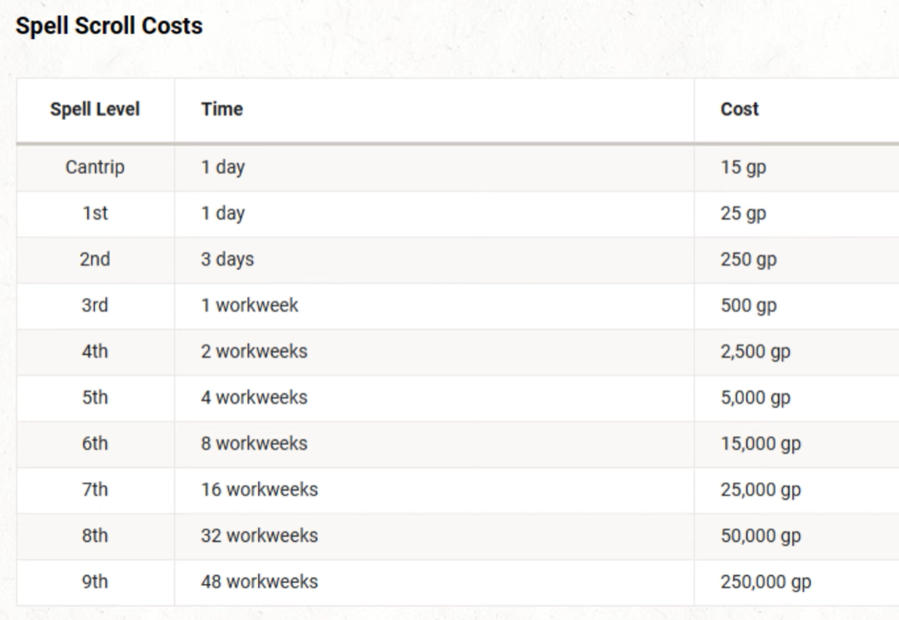

# Spell Scrolls

## Extrapolated Gold Crafted Per Day by level

These values are doubled by a Critical Success and Subtracted for a Critical Failure

Levels 1-2: 13gp / session

Levels 3-4: 25gp / session

Levels 5-6: 100gp / session

Levels 7-8: 250gp / session

Levels 9-10: 250gp / session

Levels 11-12: 175gp / session

Levels 13-14: 175gp / session

Levels 15-16: 250gp / session

Levels 17-18: 500gp / session

Levels 19-20: 1000 gp / session

## Extrapolated Item Cost and DC to craft by Rarity

Format:

- Item Rarity (This is aguideline, but the actual determination for where an item or other goal lies on this scale will be determined by it's gold cost)
- DC: This is the DC a player needs to pass with their crafting or ability check to recieve the gold put into the work for this item.
- Gold value: This is a range of gp  value. Whenever a player is crafting an item or attempting to obtain some goal consult the values here to determine where on the scale the characters desired endstate lies.
- Character level: This is the minimum character level requirement that a character must meet if they want to attempt to craft an item at this level or conduct an activity at this level. There are some excpetions, such as gargnering reputation with a faction which a character can always attempt.

* Common
  * DC 10
  * 0 - 20 gp
  * Character Level: 1
* Common
  * DC 13
  * 25 - 200 gp
  * Character Level: 1
* Uncommon
  * DC 13
  * 250 - 450 gp
  * Character Level: 3
* Uncommon
  * DC 15
  * 500 - 2000 gp
  * Character Level: 5
* Rare
  * DC 15
  * 2500 - 4500 gp
  * Character Level: 7
* Rare
  * DC 17
  * 5000 - 10000 gp
  * Character Level: 9
* VeryRare
  * DC 17
  * 15000 - 20000 gp
  * Character Level: 11
* VeryRare
  * DC 18
  * 25000 - 45000 gp
  * Character Level: 13
* VeryRare
  * DC 18
  * 50000 - 200000
  * Character Level: 15
* Legendary
  * DC 19
  * 250000 +
  * Character Level: 17

## Spell scroll cost:
