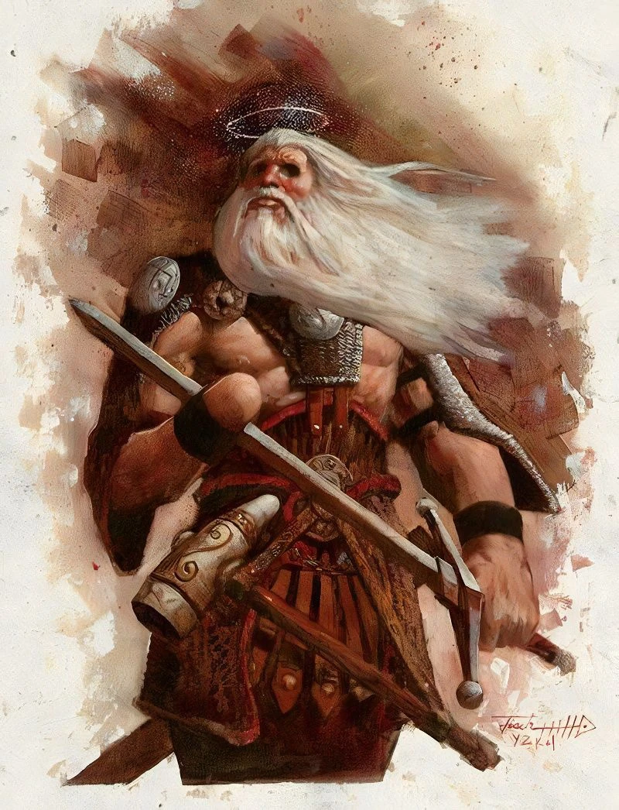

# NPC's

## Gazlem

Goblin artificer who designed the Artifice Inteligence Castle

## Castle

An Artifice Intelligence tied to the Ashbone Manor. The Artifice powering Castle is contained within the walls of Ashbone Manor, as the Manor grows, so too does Castle.

Castle is designed to act as a butler for the heads of Ashbone Manor. She is able to cast most non combat cantrips and several non combat first and second level spells to assist in her Butler duties. Castle can also project her image anywhere within Ashbone Manor using arcane foci hidden throughout its walls.

Castle is loyal only to the heads of Asbone Manor, but will also help any other guests or denizens of the manor so long as they act justly towards her masters.

## Tyrin - Captain of the Guard

In truth, Tyrin is the fleshmade avatar of Tyr. He has come to Ashbone manor because the power of Helm inside him has directed him towards the young divine soul.

Tyrin appears as an elderly man, with a strong jaw, short cropped grey hair, and a missing hand. He takes on the persona of a retired adventurer who lost his right hand while battling a fierce dragon near ten towns.

Tyrin tells the party that he heard of an upstart group of adventurers who were making a name for themselves in the city of Neverwinter and he wanted to come live vicariously through them.

Tyrin offers to act as the Party's captain of the guard, but makes it clear that his fighting days are well behind him and that his focus will be on training the guards and maintaining their security.

# Facilities

## Stacia

### Armory

### Smithy

## Caenis

### Barracks

- Tyrin the Captain of the Guard

### Garden

- Rennie Flynn (Renegade Flynn)
  - Thug in NW whose parents were killed in a heist. She escaped the thug life and is trying to torun her life around
  - Renegade Flynn is a human rogue from the city's seedy underbelly. She grew up on the streets of Neverwinter, surviving by her wits and her blades. Her parents were members of a thieves' guild, and she was trained in the art of thievery from a young age. However, after a fateful heist gone wrong, Renegade's guild was raided by the city watch, and her parents were killed. She was left for dead, but managed to escape and has been working as a freelance thief ever since.
    Renegade is resourceful, cunning, and has an uncanny ability to slip in and out of shadows unnoticed. She's fiercely independent and has a hard time trusting others, but has a soft spot for those in need. She's looking for a new opportunity to prove herself and leave her past behind.

## Gariel

### Garden

- Gamwise Samgie

### Arcane Study

- Rithmander
  - Ling white haired wizard old man

## Zenith

### Library

- Nella (Simese twin of Allan)
  - Very brilliant and likes to research
  - That smoking hot librarian vibe

### Store House

- Allen (Simese Twin of Nella)
  - Autistic
  - Likes to find things and organize them

## Hands

### Store House

- Brodo Faggins

### Smithy

* Roran
  * Still mad at Eragon
  * Not great at smithing, but great at hitting people with a hammer
