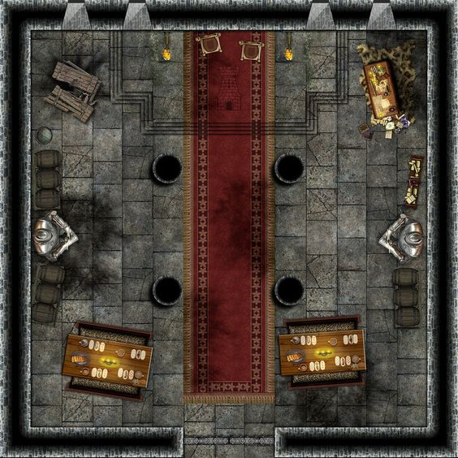

As the characters enter the burning academy they are quickly startled by a figure who appears ouf of the shadows. 

```
What? I was expecting Aribeth, not some wet behind the ears welp. Minions (as he sommons minions to batle the characters) deal with this while I find the waterdavian creatures.
```

The figure summons a group of skeletons before misty stepping away and running off down the grand hall.

Battle notes: At the start of each round flames will spread along the battle ground. Any creature that starts its turn in the flames takes 1d6 fire damage.

At the top of every three rounds flaming debree will fall down from the cieling crashing in a 10 ft square. Creatures in those squares must succeed on a dc 13 DEX saving throw or take 1d6 bludgeoning damage and 1d6 fire damage.


