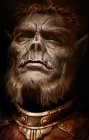

**Description:** This Uthgardt barbarian remains tight-lipped about his reasons for being in Neverwinter. His services as a mercenary are for hire, but only for someone with the right coin and temperament suitable to this honorable half-orc.

In the [original campaign](https://nwn.fandom.com/wiki/Original_campaign "Original campaign"), Dealan tells the story of his banishment from the Uthgardt tribe, leading to special item-recovery quests, as all henchmen in original campaign do.

Daelan was one of many adventurers to later answer the call to [Waterdeep](https://nwn.fandom.com/wiki/Waterdeep "Waterdeep") during the [drow](https://nwn.fandom.com/wiki/Drow "Drow") attacks in the *Hordes of the Underdark* campaign.

He is notable for his use of [power attack](https://nwn.fandom.com/wiki/Power_attack "Power attack") and [knockdown](https://nwn.fandom.com/wiki/Knockdown "Knockdown") [feats](https://nwn.fandom.com/wiki/Feat "Feat").

**[Spoiler warning](http://en.wikipedia.org/wiki/Spoiler_warning): *Plot and/or ending details follow.***

In original campaign, Daelan gives the PC an amulet which can be upgraded in chapter 2 and 3. His quests need the items:

* Chapter 1: Brooch (found in a chest on a boat in south-western part of [Docks district](https://nwn.fandom.com/wiki/Docks_district "Docks district"))
* Chapter 2: Great Axe (found on a [dwarf](https://nwn.fandom.com/wiki/Dwarf "Dwarf") named Gorkan, in Mutamin's dungeon Level 3)
* Chapter 3: Uthgardt Ceremonial spear (given by Zokan in the Uthgardt keep in Fort Illkard's homesteads, obtainable by killing him or giving the plague cure). Note: In the Enhanced Edition this item is not marked as a plot item so can be sold by mistake.
